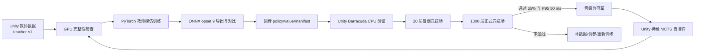

# ArkCard GPU 训练机执行计划

> **schema 更新（2026-08-11）**：本文记录的是 schema 1 首轮的执行细节。效果枚举扩展后
> `AIEncodingSchema` 已提升到 schema v2，特征维度变为 `2,180 / 739`（策略输入 `2,919`）；
> 旧 `teacher-v1` / `self-play-r001` 数据与 `teacher-v1-001` checkpoint 不再兼容，
> 新一轮需按 `Tools/AITraining/configs/round2.toml` 重新生成 `teacher-v2` 数据并重训。

## 1. 目标与当前输入

本文档用于把 Unity 机器已经生成的教师数据传到 NVIDIA GPU 机器，完成首个策略/价值模型的训练、ONNX 导出、回传、Unity CPU 验收和竞技场晋级。

首轮训练固定使用以下输入：

| 项目 | 当前值 |
| --- | --- |
| 数据集 | `teacher-v1` |
| 决策样本 | `100,016` |
| 完整对局 | `1,737` |
| 数据分片 | `49` |
| 候选动作 | `620,737` |
| 平均候选动作数 | `6.2064` |
| 正/负/平 outcome | `47,262 / 52,754 / 0` |
| 教师搜索 | `300 iterations / 35 ms / rollout 4` |
| 数据随机种子 | `20260806` |
| 特征 schema | `1` |
| 状态/动作特征维度 | `1,892 / 655` |

本轮建议模型版本固定为 `teacher-v1-001`。一旦开始训练，不要覆盖同名数据、checkpoint 或导出目录；重跑应使用 `teacher-v1-002` 等新版本。

> 当前教师数据使用固定牌组配置，先手胜率约为 `70.1%`。观察方 outcome 本身接近均衡，但牌组覆盖和先后手分布仍然较窄。它适合训练首个候选模型，不足以单独证明模型具备完整泛化能力，最终是否可发布必须由交换先后手的 Unity 竞技场决定。

## 2. 完整工作流



每个阶段的硬门槛如下：

| 阶段 | 必须得到的产物 | 通过条件 |
| --- | --- | --- |
| 代码冻结 | 训练代码 commit | GPU 机能检出同一 commit，工作区干净 |
| 数据传输 | 49 个 `.arkds.gz` 及 manifest | SHA-256 全通过，Python 解码为 100,016 条 |
| 训练 | `latest.pt`、训练历史、环境记录 | epoch 19 完成，schema/维度正确，loss 有限 |
| 导出 | `policy.onnx`、`value.onnx`、`manifest.json` | opset 9，PyTorch/ONNX 最大误差不超过 `1e-4` |
| Unity 验证 | Barracuda 导入资产和配置 | 编译、EditMode、模型校验全部通过 |
| 模型晋级 | 竞技场报告 | 至少 1,000 局、得分率不低于 55%、P95 不超过 50 ms |

## 3. 第零步：先冻结训练代码

当前仓库 `main` 的已提交基线是 `73f77ff`，它早于本次 ML 训练工具实现。GPU 机不能直接在该 commit 上训练。

在 Unity 机器上先审核并提交当前 ML 实现，再推送到 GitHub：

```powershell
cd D:\biancheng\明日方舟卡牌
git status --short
git diff --check

# 只暂存本次神经 MCTS、训练工具、测试和文档相关文件；不要盲目 git add .
git add .gitignore Assets/AI Assets/AI.meta Assets/Scenes/BattleScene.unity `
  Assets/Scripts/AI Assets/Scripts/Controller/AIController.cs `
  Assets/Scripts/Editor/AITraining Assets/Scripts/Editor/AITraining.meta Assets/Scripts/ArkCard.Runtime.asmdef `
  Assets/Scripts/Editor/ArkCard.Editor.asmdef Assets/Tests Docs Tools

git diff --cached --stat
git commit -m "实现神经引导 MCTS 训练链路"
git push origin main
git rev-parse HEAD
```

把最后一条命令输出记为 `TRAINING_COMMIT`。如团队不允许直接推送 `main`，在功能分支提交并推送，GPU 机仍应按精确 commit 检出，而不是依赖会继续移动的分支名。

停止条件：训练代码尚未提交/推送、Unity 编译失败或 EditMode 回归未通过时，不进入 GPU 训练。

## 4. GPU 机器要求

主流程假设 GPU 机使用 Ubuntu Linux、NVIDIA 驱动和单张 CUDA GPU。推荐配置：

- Python `3.10` 到 `3.12`。
- NVIDIA GPU 显存至少 `8 GB`。当前模型约为百万级参数，显存不是主要瓶颈。
- 可用磁盘至少 `20 GB`，数据和运行目录放在本地 NVMe。
- 已安装 `git`、`python3-venv`、`openssh-client`、`tmux`。
- 只要求可用 NVIDIA 驱动，不要求系统安装完整 CUDA Toolkit；PyTorch wheel 自带所需 CUDA runtime。

先检查驱动和硬件：

```bash
nvidia-smi
python3 --version
df -h /data
```

若 `nvidia-smi` 不可用，先修复驱动，不要用 CPU 完成正式训练。CPU 只适合数据读取和小规模冒烟测试。

## 5. GPU 目录与代码检出

以下命令约定所有产物都放在 `/data/arkcard`：

```bash
export ARKCARD_ROOT=/data/arkcard
export ARKCARD_REPO="$ARKCARD_ROOT/repo"
export ARKCARD_DATASET="$ARKCARD_ROOT/datasets/teacher-v1"
export ARKCARD_RUN="$ARKCARD_ROOT/runs/teacher-v1-001"
export ARKCARD_EXPORT="$ARKCARD_ROOT/exports/teacher-v1-001"
export TRAINING_COMMIT=<替换为第零步得到的完整commit>

mkdir -p "$ARKCARD_ROOT/datasets" "$ARKCARD_ROOT/runs" "$ARKCARD_ROOT/exports"
git clone git@github.com:ALVIN23333/ArkCard.git "$ARKCARD_REPO"
git -C "$ARKCARD_REPO" checkout --detach "$TRAINING_COMMIT"
git -C "$ARKCARD_REPO" status --short
git -C "$ARKCARD_REPO" rev-parse HEAD
```

`git status --short` 必须为空，`rev-parse HEAD` 必须与 Unity 机器记录的 `TRAINING_COMMIT` 完全一致。

推荐目录结构：

```text
/data/arkcard/
  repo/                         训练代码，只从 Git 获取
  datasets/teacher-v1/          Unity 教师分片，只读
  runs/teacher-v1-001/          checkpoint、history、日志、环境记录
  exports/teacher-v1-001/       policy/value ONNX 与 manifest
```

## 6. 创建 CUDA Python 环境

使用独立虚拟环境，并先安装 CUDA 版 PyTorch，避免 `pip` 意外选择 CPU wheel：

```bash
python3 -m venv "$ARKCARD_ROOT/venv"
source "$ARKCARD_ROOT/venv/bin/activate"
python -m pip install --upgrade pip setuptools wheel

# cu124 是稳定基线；如果驱动或内部镜像要求其他版本，替换为对应的官方 PyTorch CUDA index。
python -m pip install --index-url https://download.pytorch.org/whl/cu124 "torch>=2.2,<3"
python -m pip install "numpy>=1.24,<3" "onnx>=1.14,<2" "onnxruntime>=1.17,<2" "pytest>=8,<9"
python -m pip install --no-deps -e "$ARKCARD_REPO/Tools/AITraining"
```

立即验证 CUDA，输出中的 `cuda_available` 必须为 `True`：

```bash
python - <<'PY'
import torch
print("torch=", torch.__version__)
print("torch_cuda=", torch.version.cuda)
print("cuda_available=", torch.cuda.is_available())
print("gpu=", torch.cuda.get_device_name(0) if torch.cuda.is_available() else "NONE")
assert torch.cuda.is_available(), "CUDA PyTorch is not available"
PY
```

如果这里失败，应检查 PyTorch wheel、驱动和容器的 GPU 映射。不要继续训练后再根据速度猜测是否使用了 GPU。

## 7. 从 Unity 机器传输数据

数据集由 Git 忽略，必须单独传输。先在 Unity Windows 机器生成包含所有文件的校验清单：

```powershell
$Dataset = 'D:\biancheng\明日方舟卡牌\Artifacts\AI\Datasets\teacher-v1'

Get-ChildItem -LiteralPath $Dataset -File |
  Where-Object Name -ne 'SHA256SUMS' |
  Sort-Object Name |
  Get-FileHash -Algorithm SHA256 |
  ForEach-Object {
    '{0}  {1}' -f $_.Hash.ToLowerInvariant(), [IO.Path]::GetFileName($_.Path)
  } |
  Set-Content -Encoding ascii (Join-Path $Dataset 'SHA256SUMS')

scp -r $Dataset "<GPU用户名>@<GPU地址>:/data/arkcard/datasets/"
```

在 GPU 机检查传输结果：

```bash
cd "$ARKCARD_DATASET"
sha256sum -c SHA256SUMS

test "$(find . -maxdepth 1 -name '*.arkds.gz' | wc -l)" -eq 49
test "$(find . -maxdepth 1 -name '*.manifest.json' | wc -l)" -eq 49
test -f legacy-teacher-v1-summary.json
```

`sha256sum` 任意一项失败都应重新传输对应文件，不能跳过损坏分片继续训练。

## 8. GPU 训练前检查

先执行 Python 单元测试和完整数据解码：

```bash
source "$ARKCARD_ROOT/venv/bin/activate"
cd "$ARKCARD_REPO/Tools/AITraining"
pytest -q
arkcard-inspect-dataset "$ARKCARD_DATASET" | tee "$ARKCARD_ROOT/datasets/teacher-v1-inspection.json"
```

检查结果必须与以下关键值一致：

```json
{
  "shards": 49,
  "samples": 100016,
  "candidateActions": 620737,
  "positiveOutcomes": 47262,
  "negativeOutcomes": 52754,
  "drawOutcomes": 0
}
```

然后记录训练环境，便于以后复现：

```bash
mkdir -p "$ARKCARD_RUN"
git -C "$ARKCARD_REPO" rev-parse HEAD | tee "$ARKCARD_RUN/git-commit.txt"
nvidia-smi -q > "$ARKCARD_RUN/nvidia-smi.txt"
python -m pip freeze > "$ARKCARD_RUN/pip-freeze.txt"
cp "$ARKCARD_DATASET/SHA256SUMS" "$ARKCARD_RUN/dataset-SHA256SUMS.txt"
```

## 9. 执行首轮教师模仿训练

建议在 `tmux` 中运行，避免 SSH 断线终止训练：

```bash
tmux new -s arkcard-teacher-v1
```

在 tmux 会话内执行：

```bash
source /data/arkcard/venv/bin/activate
export ARKCARD_ROOT=/data/arkcard
export ARKCARD_REPO="$ARKCARD_ROOT/repo"
export ARKCARD_DATASET="$ARKCARD_ROOT/datasets/teacher-v1"
export ARKCARD_RUN="$ARKCARD_ROOT/runs/teacher-v1-001"
export PYTHONHASHSEED=20260806
export CUBLAS_WORKSPACE_CONFIG=:4096:8
set -o pipefail

cd "$ARKCARD_REPO/Tools/AITraining"
arkcard-train "$ARKCARD_DATASET" \
  --output "$ARKCARD_RUN" \
  --epochs 20 \
  --batch-size 64 \
  --shuffle-buffer 4096 \
  --learning-rate 3e-4 \
  --weight-decay 1e-4 \
  --value-weight 1.0 \
  --seed 20260806 \
  --device cuda \
  2>&1 | tee "$ARKCARD_RUN/train.log"
```

另开一个 SSH 终端监控：

```bash
watch -n 2 nvidia-smi
tail -f /data/arkcard/runs/teacher-v1-001/train.log
```

当前读取器会流式解压 gzip 并在 Python 中组 batch，GPU 利用率不高时瓶颈可能在 CPU 解压和样本整理，而不是显存。可先把 `--batch-size` 提升到 `128` 做一轮基准；若吞吐没有提升，应优先实现多进程预取或预解压缓存，不要继续盲目增大 batch。

### 中断恢复

`latest.pt` 在每个完整 epoch 结束后覆盖写入。若在 epoch 中途失败，只能从上一个完整 epoch 恢复：

```bash
if [ -f "$ARKCARD_RUN/training-history.json" ]; then
  cp "$ARKCARD_RUN/training-history.json" "$ARKCARD_RUN/training-history-before-resume.json"
fi

arkcard-train "$ARKCARD_DATASET" \
  --output "$ARKCARD_RUN" \
  --epochs 20 \
  --batch-size 64 \
  --shuffle-buffer 4096 \
  --learning-rate 3e-4 \
  --weight-decay 1e-4 \
  --value-weight 1.0 \
  --seed 20260806 \
  --device cuda \
  --resume "$ARKCARD_RUN/latest.pt" \
  2>&1 | tee -a "$ARKCARD_RUN/train.log"
```

`--epochs 20` 表示最终训练到 epoch `19`，不是额外增加 20 个 epoch。当前脚本恢复时会重写 `training-history.json`，因此恢复前必须保存旧 history。

## 10. 检查 checkpoint

训练命令返回码必须为 0。然后检查最后 epoch、schema、维度和 loss：

```bash
python - <<'PY'
import math
import torch

path = "/data/arkcard/runs/teacher-v1-001/latest.pt"
checkpoint = torch.load(path, map_location="cpu", weights_only=False)
assert checkpoint["epoch"] == 19, checkpoint["epoch"]
assert checkpoint["schema_version"] == 1
assert checkpoint["state_feature_count"] == 1892
assert checkpoint["action_feature_count"] == 655
metrics = checkpoint["metrics"]
for name in ("policy_loss", "value_loss", "total_loss"):
    assert math.isfinite(float(metrics[name])), (name, metrics[name])
assert metrics["samples"] == 100016
print(metrics)
PY

cp "$ARKCARD_RUN/latest.pt" "$ARKCARD_RUN/teacher-v1-001.pt"
sha256sum "$ARKCARD_RUN/teacher-v1-001.pt" > "$ARKCARD_RUN/checkpoint-SHA256SUMS.txt"
```

loss 不要求逐 epoch 单调下降，但后期应整体稳定。当前 `train.py` 没有验证集和 best-checkpoint 选择，因此不能仅凭训练 loss 判定是否晋级；`latest.pt` 只是首轮候选，必须继续进行 ONNX、Unity 和竞技场验证。

## 11. 导出 Barracuda 兼容 ONNX

不要使用 `--skip-parity`。默认导出会生成 opset 9 模型，并用 ONNX Runtime 与 PyTorch 比较：

```bash
source "$ARKCARD_ROOT/venv/bin/activate"
cd "$ARKCARD_REPO/Tools/AITraining"
mkdir -p "$ARKCARD_EXPORT"
set -o pipefail

arkcard-export "$ARKCARD_RUN/teacher-v1-001.pt" \
  --output "$ARKCARD_EXPORT" \
  --model-version teacher-v1-001 \
  2>&1 | tee "$ARKCARD_EXPORT/export.log"
```

进一步检查 ONNX 结构和导出文件：

```bash
python - <<'PY'
import json
from pathlib import Path
import onnx

root = Path("/data/arkcard/exports/teacher-v1-001")
for name in ("policy.onnx", "value.onnx"):
    model = onnx.load(root / name)
    onnx.checker.check_model(model)
    assert model.opset_import[0].version == 9

manifest = json.loads((root / "manifest.json").read_text())
assert manifest["modelVersion"] == "teacher-v1-001"
assert manifest["featureSchemaVersion"] == 1
assert manifest["stateFeatureCount"] == 1892
assert manifest["actionFeatureCount"] == 655
assert max(manifest["parity"].values()) <= 1e-4
print(json.dumps(manifest, indent=2))
PY

cd "$ARKCARD_EXPORT"
sha256sum policy.onnx value.onnx manifest.json > SHA256SUMS
sha256sum -c SHA256SUMS
```

输出目录中用于 Unity 的正式文件只有：

```text
policy.onnx
value.onnx
manifest.json
```

`latest.pt`、日志、`pip-freeze.txt` 和训练历史应留在 GPU 归档目录，不能放进 Unity 的 `Assets/AI/Models/`。

## 12. 回传到 Unity 机器

先回传到 Unity 工程外的暂存目录，再核验 SHA-256：

```powershell
$Staging = 'D:\ArkCardModelStaging\teacher-v1-001'
New-Item -ItemType Directory -Force -Path $Staging | Out-Null
scp -r "<GPU用户名>@<GPU地址>:/data/arkcard/exports/teacher-v1-001/*" $Staging

Push-Location $Staging
Get-Content SHA256SUMS
Get-FileHash policy.onnx,value.onnx,manifest.json -Algorithm SHA256
Pop-Location
```

确认结果后，将 `policy.onnx`、`value.onnx`、`manifest.json` 放到：

```text
D:\biancheng\明日方舟卡牌\Assets\AI\Models\
```

不要复制 `SHA256SUMS`、checkpoint 或日志到该目录，不要手工编辑 `.asset` YAML。

## 13. Unity 导入与正式验收

在 Unity 中按顺序执行：

1. 等待 `policy.onnx` 和 `value.onnx` 导入完成，确认没有编译错误。
2. 执行 `Tools > AI Training > Refresh Default Config From Promoted Models`。
3. 回读 `Assets/AI/Configs/DefaultAIModelConfig.asset`，确认：模型引用非空、schema 为 `1`、版本为 `teacher-v1-001`、checksum 非空。
4. 不要把教师旧 MCTS 的 `300/35/4` 直接当作神经 MCTS 配置。当前神经配置默认是 `192 iterations / 50 ms / 4 determinizations`，最终是否满足要求由 Windows CPU P95 实测决定。
5. 运行全部 EditMode 测试和固定黄金输入的 Barracuda 对比，最大绝对误差必须不超过 `1e-4`。
6. 先运行 20 局 smoke arena；通过且没有推理回退日志后，再运行 1,000 局正式竞技场。

正式竞技场命令：

```powershell
& 'D:\unityEditor\2022.3.62f3c1\Editor\Unity.exe' -batchmode -quit `
  -projectPath D:\biancheng\明日方舟卡牌 `
  -executeMethod ArenaRunner.RunFromCommandLine `
  -aiArenaGames 1000 `
  -aiSeed 20260806 `
  -aiModelConfig Assets/AI/Configs/DefaultAIModelConfig.asset `
  -aiArenaReport Artifacts/AI/Reports/teacher-v1-001-arena.json `
  -logFile Artifacts/AI/Reports/teacher-v1-001-unity.log
```

在任意已安装训练工具的机器上复核报告：

```bash
arkcard-check-arena /path/to/teacher-v1-001-arena.json \
  --minimum-games 1000 \
  --minimum-score-rate 0.55 \
  --maximum-p95-ms 50
```

只有以下条件同时满足才可提交模型资产和配置：

- 竞技场完成至少 `1,000` 局。
- 候选得分率（平局计半分）不低于 `55%`。
- 当前 Windows 发布 CPU 上决策 P95 不超过 `50 ms`。
- 全部规则、隐藏信息、编码、回退和 Barracuda 回归测试通过。
- Unity Console 没有模型维度、schema、checksum、非有限输出或推理异常回退。

未通过时保留报告和 `teacher-v1-001` 全部产物，使用新版本号重新训练，不要覆盖失败记录。

## 14. 首轮之后的自博弈循环

`teacher-v1-001` 晋级后，在 Unity 机器生成 `self-play-r001` 数据；根节点训练时使用 Dirichlet 噪声，正式竞技场和发布运行必须关闭噪声。

把新的自博弈分片按第 7 节流程传到 GPU 后，可以同时读取教师和自博弈数据，并从首轮 PyTorch checkpoint 继续训练：

```bash
arkcard-train \
  /data/arkcard/datasets/teacher-v1 \
  /data/arkcard/datasets/self-play-r001 \
  --output /data/arkcard/runs/self-play-r001-candidate-001 \
  --epochs 40 \
  --batch-size 64 \
  --seed 20260806 \
  --device cuda \
  --resume /data/arkcard/runs/teacher-v1-001/teacher-v1-001.pt
```

首轮 checkpoint 的最后 epoch 是 `19`，因此 `--epochs 40` 会继续训练 epoch `20..39`。每一轮都必须使用新的数据目录、run ID、模型版本和竞技场报告。

## 15. 当前实现状态与剩余缺口

以下能力已经实现，不再是缺口：按完整 `game_id` 的训练/验证拆分、`best.pt`、history
续写、AMP、后台预取、多牌组教师矩阵、真实数据 PyTorch/ONNX parity，以及候选模型对
当前冠军配置的配对竞技场。

建立长期自博弈流水线前仍应完成：

1. 把竞技场从单一牌组对扩展为多牌组矩阵和分层报告。
2. 自动核对 Unity 数据分片 sidecar manifest 与 SHA-256，而不只依赖完整解码。
3. 加入固定黄金输入的 ONNX Runtime/Barracuda 数值对比。
4. checkpoint 保存 AMP scaler 与各 RNG 状态，支持严格可复现续训。
5. 评估自博弈前若干 ply 的访问分布温度采样，提高状态覆盖。
6. 最后再考虑多 GPU；以当前模型和数据规模，优先优化输入管线。

## 16. 最终交付清单

一次可追溯的训练至少应归档：

```text
teacher-v1-001/
  git-commit.txt
  dataset-SHA256SUMS.txt
  pip-freeze.txt
  nvidia-smi.txt
  train.log
  training-history.json
  teacher-v1-001.pt
  checkpoint-SHA256SUMS.txt
  export/
    policy.onnx
    value.onnx
    manifest.json
    SHA256SUMS
    export.log
  validation/
    unity-test-results.xml
    arena-report.json
    unity.log
```

Git 只提交通过晋级的 `Assets/AI/Models/policy.onnx`、`value.onnx`、`manifest.json`、对应 `.meta` 和更新后的 `DefaultAIModelConfig.asset`。数据集、checkpoint、日志和报告继续保留在 `Artifacts/AI` 或外部归档，不进入仓库。
